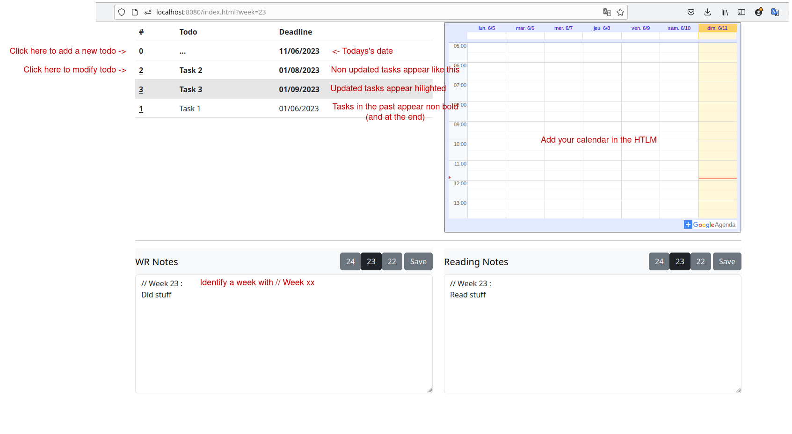
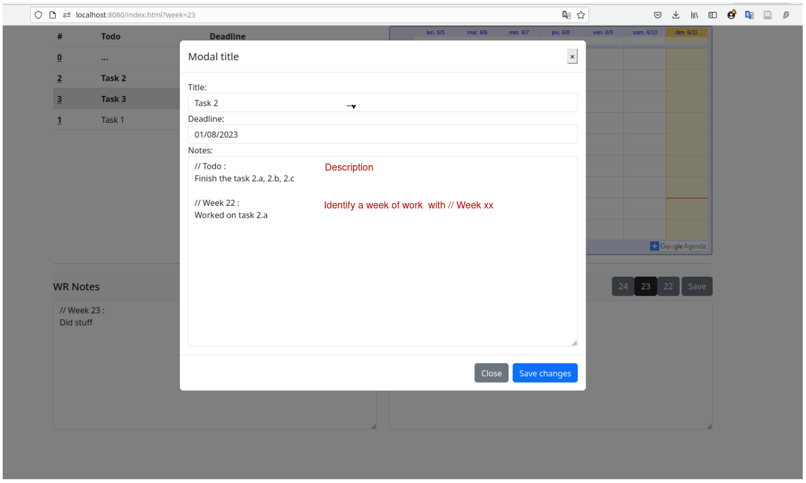

# Weekly report dashboard

## Content
- content.js : Frontend script
- server.js : Backend script
- index.{html/css} : Unique page
- data : Contain JSON files (there is no database for now)

## How to run
```bash
# Requires NodeJS
node server.js
```

Open your browser and goto `localhost:8080`.

## How to use ?



